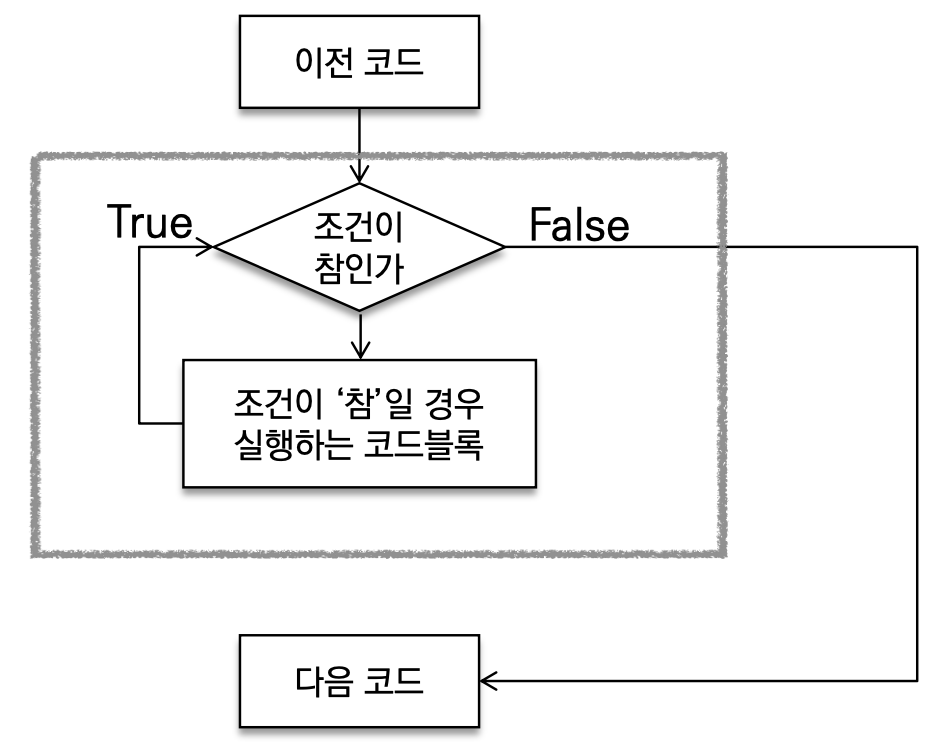
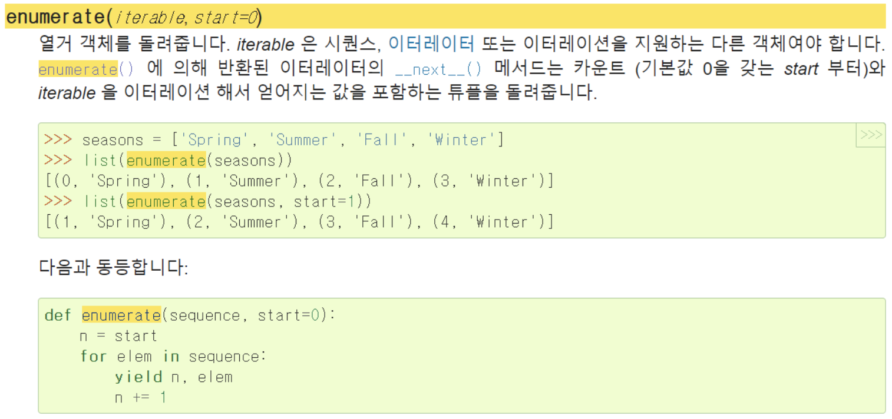
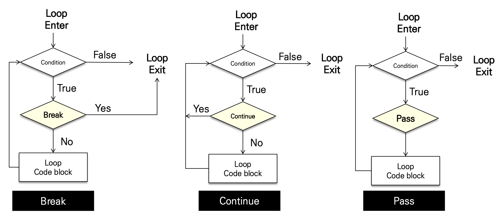

# 제어문

### 제어문(Control Statement)

- 파이썬은 기본적으로 위에서부터 아래로 순차적으로 명령을 수행
- 특정 상황에 따라 코드를 선택적으로
  - 실행(분기/조건)하거나 계속하여 실행(반복)하는 제어가 필요함
- 제어문은 순서도(flow chart)로 표현이 가능

### 조건문

- 조건문은 참/거짓을 판단할 수 있는 조건식과 함께 사용


- expression에는 참/거짓에 대한 조건식
  - 조건이참인경우이후들여쓰기되어있는코드블럭을실행 • 이외의경우else이후들여쓰기되어있는코드블럭을실행
  - else는 선택적으로 활용 가능함

## 복수조건문

- 복수의 조건식을 활용할 경우 elif를 활용하여 표현함

  ``` python
   if <expression>: # Code block
  elif <expression>:
      # Code block
  elif <expression>:
      # Code block
  else:
  # Code block
  ```

## 중첩 조건문

- 조건문은 다른 조건문에 중첩되어 사용될 수 있음 
  - 들여쓰기를 유의하여 작성할 것

``` python
if <expression>:
    # Code block
		if <expression>:
			# Code block
else:
		# Code block
```

## 조건표현식(Conditional Expression)

- 조건표현식(Conditional Expression)이란?
  - 조건표현식을일반적으로조건에따라값을할당할때활용

``` python
<true인 경우 값> if <expression> else <false인 경우 값>
```

## 반복문

- 반복문 (Loop Statement)
  - 특정 조건을 도달할 때까지, 계속 반복되는 일련의 문장



#### 반복문의 종류

- while 문
  - 종료조건에 해당하는 코드를 통해 반복문을 종료시켜야 함

- for문
  - 반복가능한 객체를 모두 순회하면 종료 (별도의 종료조건이 필요 없음)

- 반복제어
  - break, continue, for-else

#### while

- while문은 조건식이 참인 경우 반복적으로 코드를 실행
- 조건이참인경우들여쓰기되어있는코드블록이실행됨
- 코드 블록이 모두 실행되고, 다시 조건식을 검사하며 반복적으로 실행됨
- while문은 무한 루프를 하지 않도록 종료조건이 반드시 필요

``` python
while <expression>: 
# Code block
```

#### for

- for문은 시퀀스(string, tuple, list, range)를 포함한 순회가능한 객체(iterable) 요소를 모두 순회함
  - 처음부터 끝까지 모두 순회하므로 별도의 종료조건이 필요하지 않음

```` python
for <변수명> in <iterable>:
		# Code bolock
````

###### For문 일반 형식

- Iterable
  - 순회할 수 있는 자료형(str,list, dict 등)
  - 순회형 함수(range, enumerate)

###### enumerate 순회

- enumerate()
  - 인덱스와 객체를 쌍으로 담은 열거형(enumerate) 객체 반환
  - (index, value) 형태의 tuple로 구성된 열거 객체를 반환

```` python
 members = ['민수', '영희', '철수']
for i in range(len(members)):
  print(f’{i} {members[i]}')
````

```` python
 for i, member in enumerate(members):
    print(i, member)
````

- 파이썬 문서에서 확인하기



###### 딕셔너리 순회

- 딕셔너리는 기본적으로 key를 순회하며, key를 통해 값을 활용

```` python
grades = {'john': 80, 'eric': 90}
for name in grades:
		print(name)
    # john
    # eric
    print(name, grades[name])
    # john 80
    # eric 90
````

## 반복문 제어

- break
  - 반복문을 종료

- continue
  - continue 이후의 코드 블록은 수행하지 않고, 다음 반복을 수행

- for-else
  - 끝까지 반복문을 실행한 이후에 else문 실행
    - break를 통해 중간에 종료되는 경우 else 문은 실행되지 않음

### 기본형식



#### break

- break문을 만나면 반복문은 종료됨

```` python
n=0
while True:
    if n == 3:
        break
		print(n) 
    n += 1

# 실행결과
# 0
# 1
# 2
````

``` python
for i in range(10):
    if i > 1:
print('0과 1만 필요해!')
break
print(i)

# 실행결과
# 0
# 1
# 0과 1만 필요해!
```

### continue

- continue 이후의 코드 블록은 수행하지 않고, 다음 반복을 수행

```python
 for i in range(6): 
    if i % 2 == 0:
      continue
    print(i)

# 실행결과
# 1
# 3
# 5
```


### for-else

- For-else

``` python
for char in 'apple':
    if char == 'b':
        print('b!')
				break 
else:
  print('b가 없습니다.')

# 실행결과
# b가 없습니다.
```

``` python
for char in 'banana':
    if char == 'b':
        print('b!')
        break 
else:
  print('b가 없습니다.')

# 실행결과
# b!
```

