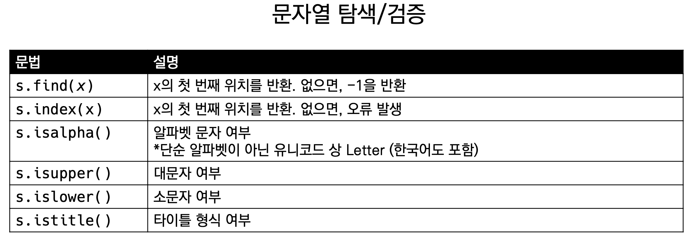
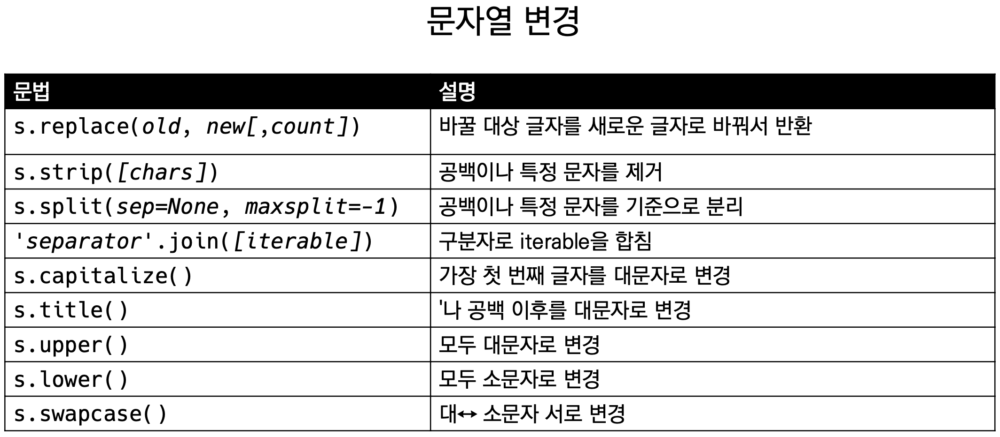
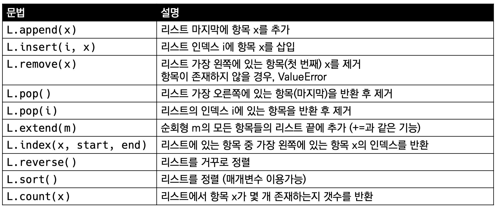
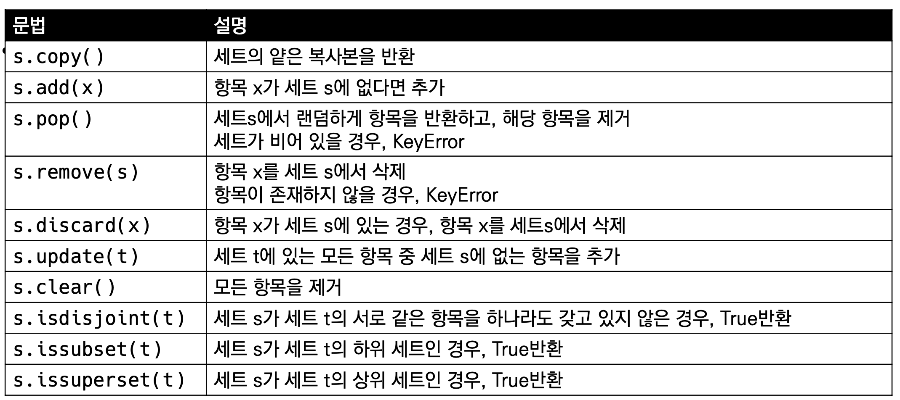
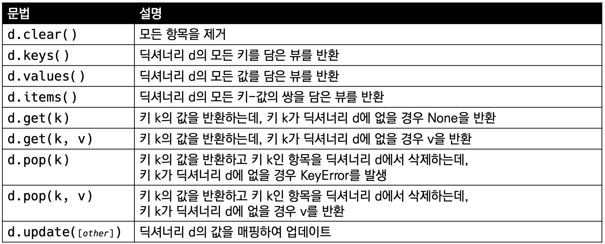

# 데이터 구조 (Data Structure)

## 변수와 타입

- int, float, complex, bool str, list, tuple, range set, dictionary


## 함수(function)

- 기능을 분해해서 우리가 독립적으로 쓸 뿐만 아니라 어떠 하나의 추상화 된 것
- input(어떤타입?) -> output(어떤타입?) 인지 아는게 중요함
- Input().split()
  - 문자열.split -> 문자열을 쪼개준다.
- [1, 2, 3].append(4)
  - 리스트.append(4) -> 4라는 값을 추가해 준다.
- 타입.메서드()
  - 타입(누가).메서드(input) => 결과 값(out put)

```python
#리스트 메서드 활용
a = [10, 1, 100]
# 정렬(sort)
new_a = a.sort() #원본 자체를 바꿔줘서 지금 a에 [1, 10, 100]이 적용 된 상태
print(a, new_a) # new_a는 리턴 값으로 받기 때문에 None이 나온다.
# [1, 10, 100] None
# 리스트 메서드를 활용하면, 그 메서드를 정렬된 상태로 변경(원본 변경)
# return되는 것은 None

#리스트에 sorted 함수를 활용
b = [10, 1, 100]
# 정렬(sort)
new_b = sorted(b)
print(b, new_b)
# [10, 1, 100] [1, 10, 100]
# sorted 함수를 활용하면, 원본을 변경하지 않음
# return되는 것은 정렬된 리스트

#실제 활용 코드
a = [10, 1, 100]
a. sort()
# a를 정렬된 상태로 활용

b = [10, 1, 100]
b = sorted(b)
# b를 정렬된 상태로 활용

```


## 메서드(methods)

### 시퀀스 (순서가 있는 데이터 구조)

#### 문자열(String Type)

- 문자들의 나열(sequence of characters)
  - 모든문자는str타입
- 문자열은 작은 따옴표(')나 큰 따옴표(")를 활용하여 표기
  - 문자열을묶을때동일한문장부호를활용
  - PEP8에서는 소스코드 내에서 하나의 문장부호를 선택하여 유지하도록 함




- 문법 앞에 is가 붙어 있으면 대부분 boolean(True / False) 로 출력

- .find(x)
  - x의첫번째위치를반환.없으면,-1을반환함.

``` python
print('apple'.find('p')) 
#1
print('apple'.find('k')) 
# -1
```

- index(x)
  - x의첫번째위치를반환.없으면,오류발생

```python
print('apple'.index('p’))
#1
'apple'.index('k')
# -------------------------------------------
# ValueError Traceback (most recent call last) # ----> 1 'apple'.index('k')
# ValueError: substring not found
```

- 문자열 관련 검증 메소드

``` python
print('abc'.isalpha()) # 문자열인지?
# True
print('Ab'.isupper()) # 모두 대문자인지?
# False 
print('ab'.islower()) # 모두 소문자인지?
# True
print('Title Title!'.istitle()) # 앞문자가 대문자인지?
# True
```



- .replace(old, new[,count])
  - 바꿀대상글자를새로운글자로바꿔서반환
  - count를 지정하면, 해당 개수만큼만 시행

```python
print('coone'.replace('o', 'a’))
# caane
print('wooooowoo'.replace('o', '!', 2)) 
# w!!ooowoo
```

- .strip([chars])
  - 특정한 문자들을 지정하면,
  - 양쪽을 제거하거나(strip), 왼쪽을 제거하거나(lstrip), 오른쪽을 제거(rstrip)
  - 문자열을 지정하지 않으면 공백을 제거함

```python
print(' 와우!\n'.strip()) # '와우!'
print(' 와우!\n'.lstrip()) # '와우!\n'
print(' 와우!\n'.rstrip()) #' 와우!' 
print('안녕하세요????'.rstrip('?’)) 
#'안녕하세요'
```

- .split(sep=None, maxsplit=-1)
  - 문자열을 특정한 단위로 나눠 리스트로 반환
    - sep이 None이거나 지정되지 않으면 연속된 공백문자를 단일한 공백문자로 간주하고, 선행/후행 공백은 빈 문자열에 포함시키지 않음.
    - maxsplit이-1인경우에는제한이없음.

``` python
print('a,b,c'.split('_’)) 
# ['a,b,c']
print('a b c'.split())
# ['a', 'b', 'c']
```

- 'separator'.join([iterable])
  - 반복가능한(iterable) 컨테이너 요소들을 separator(구분자)로 합쳐 문자열 반환
    - iterable에 문자열이 아닌 값이 있으면 TypeError 발생

```python
print(''.join(['3', '5’]))
# 35
```

- 문자열 변경 예시

```python
msg = 'hI! Everyone.' 
print(msg) 
print(msg.capitalize()) 
print(msg.title()) 
print(msg.upper()) # 전부 대문자로
print(msg.lower()) # 전부 소문자로
print(msg.swapcase()) # 대문자 <-> 소문자
# hI! Everyone. 
# Hi! everyone. 
# Hi! Everyone. 
# HI! EVERYONE. 
# hi! everyone. 
# Hi! eVERYONE.
```

### 리스트 (List)

#### 리스트(List) 정의

- 변경 가능한 값들의 나열된 자료형
- 순서를가지며,서로다른타입의요소를가질수있음

- 변경 가능하며(mutable), 반복 가능함(iterable)

- 항상 대괄호 형태로 정의하며, 요소는 콤마로 구분

  [ 0,1,2,3,4,5 ]



#### 값 추가 및 삭제

- .append(x)
  - 리스트에 값을 추가함

``` python
cafe = ['starbucks', 'tomntoms', 'hollys’] 
print(cafe)
# ['starbucks', 'tomntoms', 'hollys'] 
cafe.append('banapresso’)
print(cafe)
# ['starbucks', 'tomntoms', 'hollys', 'banapresso']
```

- .extend(iterable)
  - 리스트에 iterable의 항목을 추가함

```python
cafe = ['starbucks', 'tomntoms', 'hollys’]
print(cafe)
# ['starbucks', 'tomntoms', 'hollys']
cafe.extend(['cafe', 'test’])
print(cafe)
# ['starbucks', 'tomntoms', 'hollys', 'cafe', 'test]
```

- .insert(i, x)
  - 정해진위치i에값을추가함

```python
cafe = ['starbucks', 'tomntoms’] 
print(cafe)
# ['starbucks', 'tomntoms'] cafe.insert(0, 'start’) 
print(cafe)
# ['start', 'starbucks', 'tomntoms']
```

- .remove(x)
  - 리스트에서값이x인것삭제

```python
numbers = [1, 2, 3, 'hi’] 
print(numbers)
# [1, 2, 3, 'hi']
numbers.remove('hi’) 
print(numbers)
# [1, 2, 3]
```

```python
 numbers.remove('hi')
# ----------------
# ValueError Traceback (most recent call last) 
# ----> 1 numbers.remove('hi') <-- 없는 경우 ValueError
# ValueError: list.remove(x): x not in list
```

- .pop(i)
  - 정해진위치i에있는값을삭제하고,그항목을반환함
  - i가 지정되지 않으면, 마지막 항목을 삭제하고 반환함

```python
numbers = ['hi', 1, 2, 3] 
# ['hi', 1, 2, 3] 
pop_number = numbers.pop() 
print(pop_number)
#3
print(numbers)
# ['hi', 1, 2]
```

```python
numbers = ['hi', 1, 2, 3] 
# ['hi', 1, 2, 3] 
pop_number = numbers.pop(0) 
print(pop_number)
# 'hi'
print(numbers)
# [1, 2, 3]
```

- .clear()
  - 모든항목을삭제함

```python
numbers = [1, 2, 3] 
print(numbers)
# [1, 2, 3] 
print(numbers.clear()) 
# []
```


#### 탐색 및 정렬

- .index(x)
  - x값을찾아해당index값을반환

```python
numbers = [1, 2, 3, 4] 
print(numbers)
# [1, 2, 3, 4] 
print(numbers.index(3)) 
#2 
print(numbers.index(100)) 
# ---------------------
# ValueError Traceback (most recent call last)
#       2 print(numbers)
# 3 print(numbers.index(3)) 
# ----> 4 print(numbers.index(100))
# ValueError: 100 is not in list
```

- .count(x)
  - 원하는값의개수를반환함

```python
numbers = [1, 2, 3, 1, 1] 
print(numbers.count(1)) 
#3 print(numbers.count(100)) #0
```

- .sort()
  - 원본 리스트를 정렬함. None 반환
  - sorted 함수와 비교할 것

```python
numbers = [3, 2, 5, 1] 
result = numbers.sort() 
print(numbers, result) 
# [1, 2, 3, 5] None
# 원 본 변 경
```

```python
numbers = [3, 2, 5, 1] 
result = sorted(numbers) 
print(numbers, result)
# [3, 2, 5, 1] [1, 2, 3, 5]
# 정렬된 리스트 반환
# 원본변경 없음
```

- .reverse()
  - 순서를 반대로 뒤집음(정렬하는 것이 아님). None 반환.

```python
numbers = [3, 2, 5, 1] 
result = numbers.reverse() 
print(numbers, result)
# [1, 5, 2, 3] None
```


## 컬렉션 (순서가 없는 데이터 구조)

### 세트 (Set)

- 유일한 값들의 모음(collection)
- 순서가 없고 중복된 값이 없음.
  - 수학에서의 집합과 동일한 구조를 가지며, 집합 연산도 가능

- 변경 가능하며(mutable), 반복 가능함(iterable)
  - 단,세트는순서가없어반복의결과가정의한순서와다를수있음

#### 세트 메서드



### 딕셔너리 (Dictionary)

- 키-값(key-value) 쌍으로 이뤄진 모음(collection)
  - 키(key)
    - 불변 자료형만 가능 (리스트, 딕셔너리 등은 불가능함)
  - 값(values)
    - 어떠한형태든관계없음
- 키와값은:로구분됩니다.개별요소는,로구분됩니다.
- 변경 가능하며(mutable), 반복 가능함(iterable) 
  - 딕셔너리는 반복하면 키가 반환됩니다.

```python
students = {'홍길동': 30, '김철수': 25} 
students['홍길동']
# 30
```





#### 조회

- .get(key[,default])
  - key를통해value를가져옴
  - KeyError가 발생하지 않으며, default 값을 설정할 수 있음(기본: None)

```python
my_dict = {'apple': '사과', 'banana': '바나나'}
my_dict['pineapple']
# ------------------------------
# KeyError Traceback (most recent call last) 
# 1 my_dict = {'apple': '사과', 'banana': '바나나'}
# ----> 2 my_dict['pineapple’]
# KeyError: 'pineapple'
```

```python
my_dict = {'apple': '사과', 'banana': '바나나'} 
print(my_dict.get('pineapple'))
# None
print(my_dict.get('apple'))
# 사과 
print(my_dict.get('pineapple', 0)) 
#0
```

#### 추가 및 삭제

- .pop(key[,default])
  - key가 딕셔너리에 있으면 제거하고 해당 값을 반환 
  - 그렇지 않으면 default를 반환
  - default값이 없으면 KeyError

```python
my_dict = {'apple': '사과', 'banana': '바나나'} 
data = my_dict.pop('apple')
print(data, my_dict)
# 사과 {'banana': '바나나'}
```
```python
my_dict = {'apple': '사과', 'banana': '바나나'} 
data = my_dict.pop('pineapple')
print(data, my_dict)
# ----------------
# KeyError Traceback (most recent call last)
# 1 my_dict = {'apple': '사과', 'banana': '바나나'} 
# ----> 2 data = my_dict.pop('pineapple')
# 3 print(data, my_dict)

# KeyError: 'pineapple'
```

- .update([other])
  - 값을 제공하는 key, value로 덮어씁니다.

```python
my_dict = {'apple': '사', 'banana': '바나나'} 
my_dict.update(apple='사과')
print(my_dict)
# {‘apple’: ‘사과’, 'banana': '바나나'}
```

